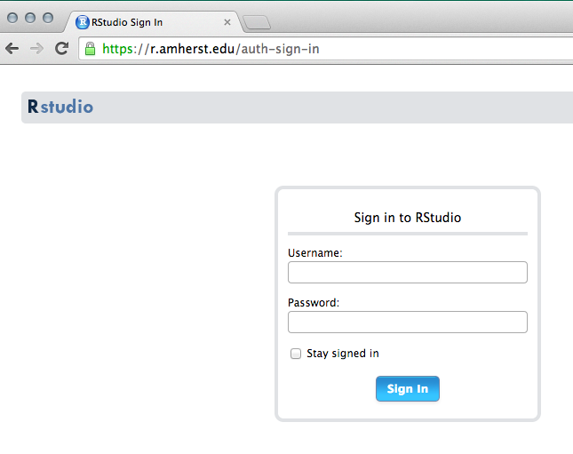
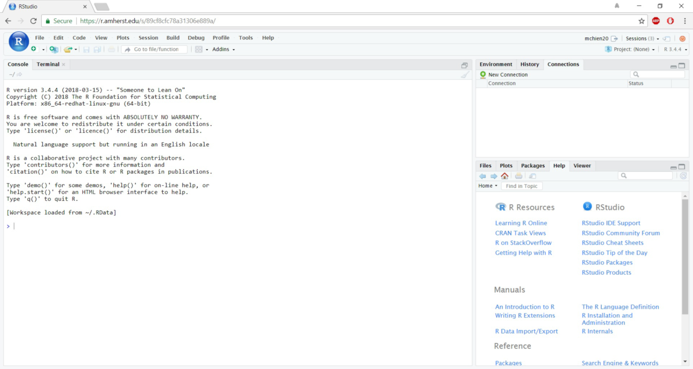
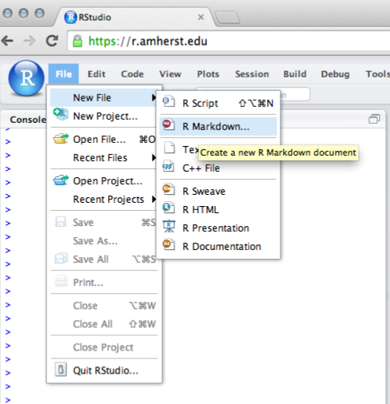
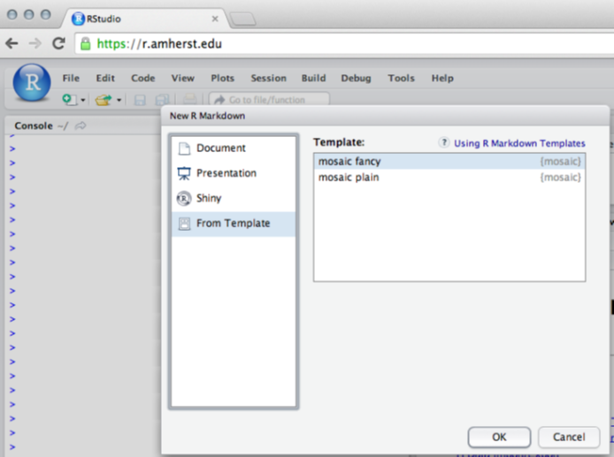
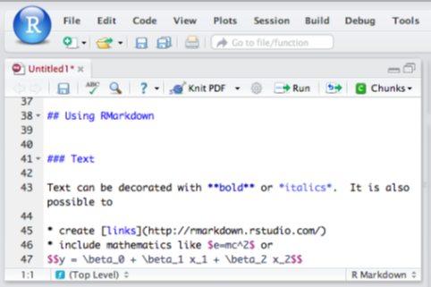
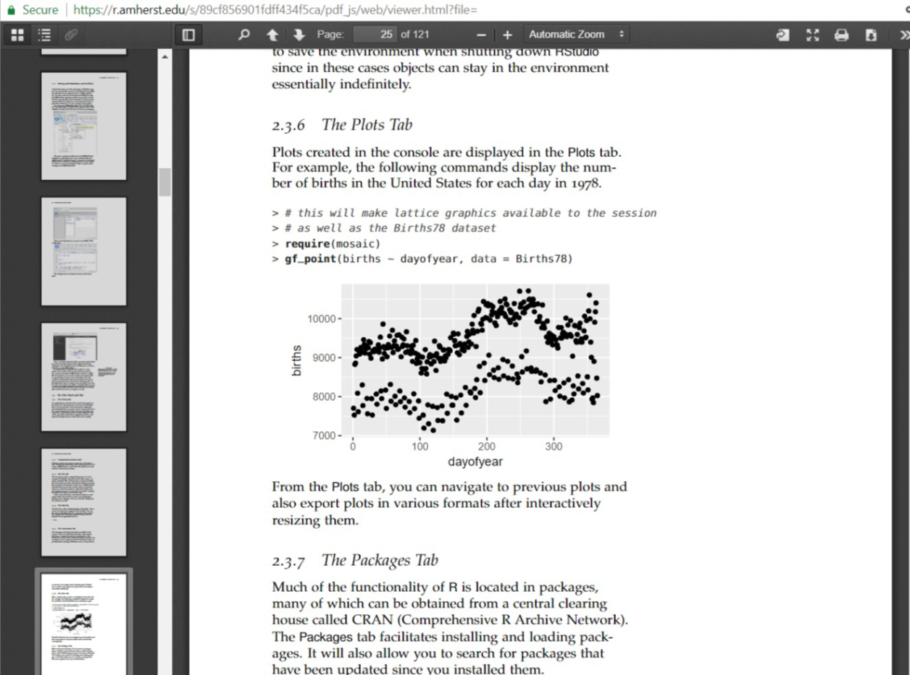

# Los geht's mit RStudio {#RStudio}

\textsf{RStudio} ist eine integrierte Entwicklerumgebung (*integrated development environment* - IDE) für \textsf{R}, die eine alternative Schnittstelle zu \textsf{R} bietet und mehrere Vorteile gegenüber den Standard \textsf{R}-Schnittstellen bietet:

::: {.hinweis data-latex=""}
Eine Reihe an Einführungsvideos ist verfügbar unter [https://nhorton.people.amherst.edu/rstudio](https://nhorton.people.amherst.edu/rstudio).
:::

- \textsf{RStudio} läuft auf Mac-, PC-, und Linux-Rechnern und bietet eine vereinfachte Schnittstelle, die 
vom Aussehen und in der Handhabung auf allen ähnlich ist. Die Standardschnittstellen für \textsf{R} sind ziemlich unterschiedlich auf den verschiedenen Platformen. Das kann den Studierenden verwirren oder ablenken und führt zu höherem Unterstützungsaufwand für den Dozenten.
- \textsf{RStudio} kann in einem Webbrowser laufen.  Zusätzlich zu eigenständigen Desktop-Versionen oder \textsf{RStudio.cloud}, kann  \textsf{RStudio} als eine Server-Anwendung installiert werden, auf die über das Internet zugreifbar ist. Die Web-Schnittstelle ist fast identisch zu der Desktopversion. Wie bei anderen Web-Services auch, melden Nutzer sich an, um Zugriff zu ihrem Konto zu erlangen. Wenn Studierende sich abmelden und später wieder anmelden, wird ihre Session wiederhergestellt und sie können an der Stelle mit ihrer Analyse weiter machen, wo sie verblieben waren, auch wenn sie sich auf einer anderen Maschine anmelden. Mit einer etwas fortgeschrittenen Einrichtung können Dozenten die Historie der Nutzung von \textsf{R} in ihrem Klassenraum speichern und Studierende können diese Historie-Datei in ihre eigene Umgebung laden.

::: {.achtung data-latex=""}
Die Desktop und Server versionen von \textsf{RStudio} sind so ähnlich, dass Sie besonders aufpassen müssen, wenn Sie beide gleichzeitig nutzen, um sicher zu gehen, dass Sie in der richtigen Version arbeiten.
:::

::: {.note data-latex=""}
Die Verwendung von \textsf{RStudio} in einem Browser ist wie Facebook für Statistik. Jedes Mal, wenn Anwender sich erneut anmelden, wird die vorherige Session wiederhergestellt und sie können weiter machen, wo sie zuletzt aufgehört haben. Nutzer können sich von jedem Gerät mit Internetzugriff anmelden.
:::

- \textsf{RStudio} unterstützt reproduzierbare Forschung. \textsf{RStudio} macht es einfach Text, statistische Analysen (\textsf{R}-Code und \textsf{R}-Output) und graphische Abbildungen zusammen im gleichen Dokument einzuschließen. Das RMarkdown System bietet eine einfache Markup Sprache und fügt die Ergebnisse in HTML zusammen.  Das \textsc{knitr/LaTeX}-System versetzt Nutzer in die Lage auch \textsf{R} und LaTeX in dasselbe Dokument zu integrieren.  Die Belohnung für das Erlernen dieses komplizierteren Systems ist eine deutlich präzisere Steuerung des Output Formates. Abhängig von der Niveaustufe des Kurses können Studierende eins dieser beiden Systeme für Hausarbeiten und Projekte verwenden.  

::: {.hinweis data-latex=""}
Um Markdown oder \textsc{knitr/LaTeX} zu verwenden, muss das Paket `knitr` auf dem System installiert sein.
:::

- \textsf{RStudio} bietet eine integrierte Unterstützung für das Bearbeiten und Ausführen von \textsf{R}-Code und Dokumenten.
- \textsf{RStudio} bietet einige nützliche Funktionalitäten über eine grafische Nutzeroberfläche (Graphical User Interface oder GUI). \textsf{RStudio} ist nicht ein GUI für \textsf{R}, aber es bietet ein GUI das Themen wie die Installation und Verwaltung von Paketen, die Steuerung, Speicherung und das Laden von Umgebungen, das Importieren und Exportieren von Daten sowie den Zugriff auf und Export von Abbildungen, Dateien und Dokumentationen vereinfacht.
- \textsf{RStudio} bietet Zugriff auf das Paket `manipulate`  Das Paket `manipulate` bietet eine Möglichkeit, einfach und schnell interaktive grafische Anwendungen zu erstellen.

Obwohl man sicherlich \textsf{R} ohne die Verwendung von \textsf{RStudio} nutzen kann, vereinfacht \textsf{RStudio} viele Dinge und wir empfehlen den Einsatz von \textsf{RStudio} stark.  Außerdem erwarten wir in der Zukunft noch weitere nützliche Funktionalitäten, da \textsf{RStudio} stetig weiterentwickelt wird.

Wir verwenden in erster Linie eine online Version von {RStudio}. \textsf{RStudio} ist eine innovative und leistungsstarke Schnittstelle zu \textsf{R}, die in einem Webbrowser oder auf Ihrer lokalen Maschine läuft.
Die Anwendung über den Browser hat den Vorteil, dass Sie nichts installieren oder konfigurieren müssen. Einfach anmelden und Sie können loslegen. Außerdem "merkt" \textsf{RStudio} sich, was Sie machen und Sie können da weitermachen, wo Sie aufgehört haben, jedesmal wenn Sie sich anmelden (auch auf einer anderen Maschine). Das ist "\textsf{R} in the cloud" und funktioniert ähnlich wie GoogleDocs oder Facebook für \textsf{R}.

::: {.hinweis data-latex=""}
\textsf{R} kann von [http://cran.r-project.org/](http://cran.r-project.org/) runtergeladen und lokal installiert werden. Das Runterladen und die Installation sind i. A. unkompliziert für Mac-, PC-, oder Linux-Systeme. \textsf{RStudio} ist über [http://www.rstudio.org/](http://www.rstudio.org/) verfügbar.
:::

## Mit einem RStudio-Server verbinden
\textsf{RStudio} Server wurden an Hochschulen eingerichtet, um cloud-basierte Berechnungen zu ermöglichen. 

::: {.note data-latex=""}
\textsf{RStudio} Server wurden schon an vielen Institutionen installiert. Nähere Informationen zu (gebührenfreien) akademischen Lizenzen für \textsf{RStudio} Server Pro und Installationsanweisungen sind über [http://www.rstudio.com/resources/faqs](http://www.rstudio.com/resources/faqs) unter dem \textsc{Academic} Reiter verfügbar.
Der \textsf{RStudio} Server funktioniert mit dem Internet Explorer allerdings nicht sehr zuverlässig.
:::

Sobald Sie mit dem Server verbunden sind, sollten Sie ein Anmeldefenster sehen:

```{r, echo=FALSE, fig.align='center', out.width="50%"}

```

\newpage
Wenn Sie sich authentiziert haben, sollten Sie die `RStudio` Schnittstelle sehen:

```{r, echo=FALSE, fig.align='center', out.width='\\textwidth'}

```

Sie können feststellen, dass \textsf{Rstudio} seine Welt in vier *Panel* aufteilt. Verschiedende *Panel* sind weiter unterteilt in mehrere Reiter. Welche Reiter in welchem *Panel* auftauchen kann vom Nutzer konfiguriert werden.

\textsf{R} kann vieles mehr als ein einfacher Taschenrechner und wir werden zu gegebener Zeit zusätzliche Eigenschaften vorstellen.  Aber, das Durchführen von einfachen Berechnungen in \textsf{R} ist eine
gute Vorgehensweise, um die Eigenschaften von \textsf{RStudio} kennenzulernen.

Befehle, die in dem Reiter \textsc{Console} eingetragen werden, werden direkt ausgeführt von `R`.
Ein guter Start, sich mit der Konsole vertraut zu machen, ist einfache Berechnungen ähnlich wie mit einem Taschenrechner auszuführen. Das meiste funktioniert analog zum typischen Taschenrechner. 

Versuchen Sie folgende Befehle in der Konsole einzugeben:
```{r}
5 + 3
15.3 * 23.4
sqrt(16)    # Quadratwurzel
```

Dieses letzte Beispiel zeigt, wie Funktionen in \textsf{R} aufgerufen werden und wie Kommentare verwendet werden. Das `#`-Zeichen muss einem Kommentar vorhergehen. Kommentare können sehr nützlich sein bei Skripten mit mehreren Befehlen oder um Code für Ihre Studierenden zu kommentieren.

Werte können zur späteren Weiterverarbeitung in benannte Variablen abgespeichert werden.

::: {.note data-latex=""}
Es ist wahrscheinlich am sinnvollsten, sich auf eine Vorgehensweise zwischen rechts-nach-links Zuweisung oder umgekehrt festzulegen, statt hin und her zu wechseln. Wir bevorzugen den Pfeiloperator, weil es visuell darstellt, was in einer Zuweisung passiert und weil es eine klare Unterscheidung zum Zuweisungsoperator darstellt, die Verwendung von `=` weist Variablen Werte zu und die Verwendung von `==` testet auf Gleichheit von Werten.
:::

```{r}
product = 15.3 * 23.4       # Speicher Ergebnis
product                     # Zeige das Ergebnis an
product <- 15.3 * 23.4      # <- kann verwendet werden statt =
product  
```

Sobald Variablen definiert sind, können sie in anderen Operationen und Funktionen verwendet werden.

```{r}
0.5 * product               # Die Hälfte von product
log(product)                # (natürlichen) Logarithmus von product
log10(product)              # Logarithmus zur Basis 10 von product
log2(product)               # Logarithmus zur Basis 2 von product
log(product, base = 2)      # Logarithmus zur Basis 2 von product, etwas anders
```

Das Semikolon kann verwendet werden, um mehrere Befehle in einer Zeile zu schreiben.  
Eine übliche Anwendung davon ist es, das Zuweisen eines Ergebnisses und Anzeigen desselben auf einmal zu machen:

```{r}
product <- 15.3 * 23.4; product    # Speicher Ergebnis und zeige es an
```


### Versionsinformation

Manchmal kann es nützlich sein zu prüfen, welche Versionen des  Paketes `mosaic`, von \textsf{R} und
\textsf{RStudio} Sie verwenden. Die Eingabe von `sessionInfo()` zeigt Informationen über die Version von \textsf{R} und die geladenen Pakete an, während  `RStudio.Version()` die Version von \textsf{RStudio} ausgibt.

```{r}
sessionInfo()
```

## Arbeiten mit Dateien
### Das Arbeiten mit R-Script Dateien
Eine Alternative ist es, \textsf{R}-Befehle in eine Datei zu speicheren. \textsf{RStudio} bietet einen integrierten Editor um diese Dateien zu bearbeiten und unterstützt die Ausführung eines Teils oder aller Befehle.
Um eine Datei zu erstellen, gehen Sie in der Menüleiste auf \textsc{File}, dann \textsc{New File} und dann \textsc{R Script}. Es öffnet sich ein Datei-Editor Fenster im \textsc{Source} Panel.
\textsf{R}-Code kann hier eingetragen werden und es stehen Schaltflächen und Menüpunkte zur Verfügung, um den gesamten Code (das sogenannte *Sourcing* der Datei), einzelne Zeilen oder einen ausgewählten Abschnitt der Datei auszuführen.

### Arbeiten mit RMarkdown und knitr/LaTeX
Eine dritte Alternative ist es \textsf{RStudio}'s Unterstützung für reproduzierbare Forschung zu nutzen. Wenn Sie \textsf{{LaTeX} schon kennen, werden Sie die Funktionialitäten vom integrierten \textsf{knitr/LaTeX} erforschen wollen. Wenn Sie \textsf{LaTeX} noch nicht kennen, dann bietet das einfachere RMarkdown System eine gute Einführung in die Welt der reproduzierbaren Forschung.  Es bietet auch eine gute Möglichkeit für Studierende, ihre Hausarbeiten und Berichte zu erstellen, die Text, \textsf{R}-Code, \textsf{R}-Output sowie Abbildungen enthalten. Um eine neue \textsf{RMarkdown}-Datei zu erstellen, wählen Sie \textsc{File}, dann \textsc{New File}, dann \textsf{RMarkdown}. Die Datei wird mit einer Kurzvorlage geöffnet, welche die Markup-Sprache skizziert.

```{r, echo=FALSE, fig.align='center', out.width="40%"}

```

Das Paket `mosaic` enthält zwei nützliche RMarkdown Vorlagen für den Einstieg: `fancy` enthält bereits etwas Schnickschnack (und hat zum Ziel, eine Übersicht der Möglichkeiten zu bieten), während `plain` nur ein Grundgerüst enthält und nützlich als Startpunkt für eine neue Analyse ist. Auf diese Vorlagen wird mittels der \textsc{Template}`-Option bei Erstellung einer neuen RMarkdown-Datei zugegriffen:

```{r, echo=FALSE, fig.align='center', out.width="50%"}

```

Klicken Sie auf die \textsc{Knit}-Schaltfläche, um die Markdown-Datei in eine HTML-, PDF-, oder Word-Datei zu konvertieren:
  
```{r, echo=FALSE, fig.align='center', out.width="50%"}

```
  
Das erzeugt eine formatierte Version des Dokumentes:
  
```{r, echo=FALSE, fig.align='center', out.width='0.9\\textwidth'}

```

Das Hilfemenü enthält eine "Markdown Quick Reference" und bietet eine kurze Beschreibung der unterstützten Markup Befehle. Die \textsf{RStudio} Webseite enthält weitere ausführlichere Anleitungen über die Verwendung von RMarkdown.
  
::: {.achtung data-latex=""}
RMarkdown und \textsf{knitr/LaTeX}-Dateien haben keinen Zugriff auf die \textsc{Console}-Umgebung, weshalb der Code in diesen Dateien eigenständig sein muss.
:::

Es ist wichtig sich zu merken, dass RMarkdown- und \textsf{knitr/LaTeX}-Dateien im Gegensatz zu \textsf{R}-Skripten, die in der Konsole ausgeführt werden und Zugriff auf die \textsc{Console}-Umgebung haben, diesen Zugriff nicht haben. Das ist eine gute Eigenschaft, weil die Dateien deshalb eigenständig sein müssen, was die Austauschbarkeit ermöglicht und gute reproduzierbare Forschungspraktiken unterstützt. Aber Anfänger, insbesondere wenn sie Analyseschritte in der Konsole ausprobieren und den Code dann über copy & paste in die Datei einfügen, werden häufig Dateien kreieren, die nicht vollständig sind und deshalb nicht korrekt kompilieren.


## Die anderen Panel und Reiter
### Der History Reiter
  
Wenn Befehle in der Konsole eingetragen werden, dann erscheinen Sie in dem \textsc{History}-Reiter. Diese Historie kann gespeichert und geladen werden, es gibt eine Suchfunktion, um vorhergehende Befehle zu finden und einzelne Zeilen oder Abschnitte können zurück an die Konsole geschickt werden. Mit geöffnetem \textsc{History}-Reiter können Sie zurück blättern und auf die vorangegangenen Befehle zugreifen. Das ist vor allem dann nützlich, wenn Befehle viel Output erzeugen und schnell aus dem Bildschirm verschwinden

### Kommunikation zwischen Reitern
\textsf{RStudio} bietet verschiedene Möglichkeiten, um \textsf{R}-Code zwischen Reitern auszutauschen. Das Klicken der \textsc{Run}-Schaltfläche im Editor-Fenster für ein \textsf{R}-Skript oder RMarkdown- oder andere Datei kopiert Zeilen mit Code in die Konsole und führt sie aus.

### Der Datei-Reiter
Der \textsc{Files}-Reiter bietet eine einfache Dateiverwaltung an. Sie kann auf übliche Weise bedient und genutzt werden, um Dateien zu öffnen, zu verschieben, umzubenennen oder zu löschen. In der Browser-Version von \textsf{RStudio} bietet der \textsf{Files}-Reiter auch die Möglichkeit, Dateien hochzuladen, um Dateien von der lokalen Maschine auf den Server zu verschieben. In RMarkdown und \textsf{knitr}-Dateien kann der Code auch in einem bestimmten Abschnitt (\textsf{chunk}) oder in allen ausgeführt werden. Jede dieser Eigenschaften ermöglicht es Code "live" auszuprobieren und gleichzeitig ein Dokument zu erstellen, das eine Aufzeichnung des verwendeten Codes enthält.
Umgekehrt kann Code aus der \textsc{History} zurück in die Konsole kopiert werden, um die Befehle nochmals auszuführen (ggf. nach Bearbeitung) oder in eine der Dateiverwaltungs-Reiter, um in einer Datei eingefügt zu werden.
  
  
### Der Hilfe-Reiter
In dem \textsc{Help}-Reiter zeigt \textsf{RStudio} die \textsf{R}-Hilfe-Seiten an. Diese können durchsucht und navigiert werden. Sie können auch eine Hilfeseite öffnen, indem Sie den `?`-Operator in der Konsole verwenden.
Zum Beispiel führt folgender Befehl dazu, dass die Hilfeseite zur Logarithmusfunktion aufgerufen wird:

```{r, eval=FALSE}
?log
```


### Der Umgebungs-Reiter
Der \textsc{Environment}-Reiter zeigt die Objekte, die für die Konsole zur Verfügung stehen. Diese sind unterteilt in Daten, Werte (Objekte die weder Dataframe noch Funktionen sind) und Funktionen. Die Besen-Schaltfläche kann verwendet werden, um alle Objekte aus der Umgebung zu entfernen und es ist empfehlenswert, das ab und zu durchzuführen, vorallem dann, wenn Sie auf dem RStudio Server arbeiten oder wenn Sie sich dafür entscheiden, die Umgebung beim Schließen von \textsf{RStudio} abzuspeichern. In diesen Fällen könnten die Objekte sonst quasi ewig in der Umgebung gespeichert bleiben.

### Der Grafik-Reiter
Diagramme, die in der Konsole erzeugt werden, werden im \textsc{Plots}-Reiter angezeigt. Zum Beispiel zeigen die folgenden Befehle die Anzahl der Geburten in den Vereinigten Staaten für jeden Tag aus 1978 an:

```{r}
library(mosaic)
gf_point(births ~ day_of_year, data = Births78) 
```

Innerhalb des Grafik-Reiters haben Sie Zugriff auf vorherige Plots und Sie können diese, nach interaktiver Größenanpassung, in verschiedenen Formaten exportieren.

### Der Paket-Reiter
Ein großer Teil der \textsf{R}-Funktionalitäten befindet sich in Paketen, die meistens über eine zentrale Anlaufstelle namens CRAN (Comprehensive \textsf{R} Archive Network) verfügbar sind.  Der \textsc{Packages}-Reiter vereinfacht die Installation und das Laden der Pakete. Er ermöglicht es auch Pakete zu finden, die seit ihrer Installation ein Update bekommen haben.